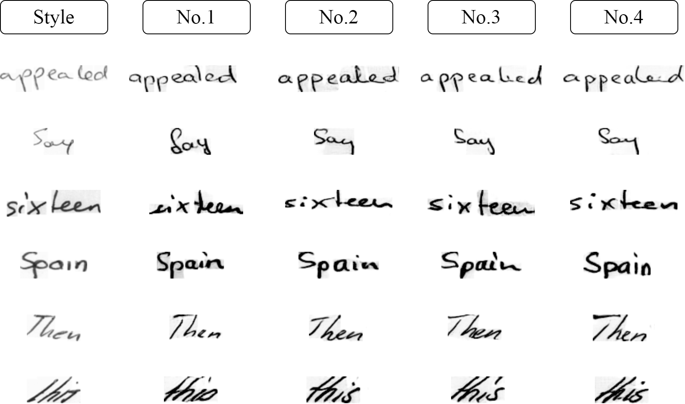

# MuS: Handwritten Text Generation with Multimodal Representation for Accurate Character Structure

This repository contains the official PyTorch implementation for the paper **"Handwritten Text Generation with Multimodal Representation for Accurate Character Structure"**.

Our model, **MuS** (**Mu**ltimodal **S**tructural Generator), introduces a novel framework that leverages both symbolic (text) and visual (rendered image) representations to significantly improve the structural accuracy of generated handwritten text.


*Overview of the proposed MuS architecture.*

## Key Contributions
- **Multimodal Content Encoder**: Fuses features from both text and its rendered image to capture fine-grained character structures.
- **Text Structure Loss ($L_T$)**: A novel loss function that supervises content accuracy and structural integrity from an image-level perspective.
- **State-of-the-Art Performance**: Achieves leading results on the IAM and CVL datasets in terms of generation quality (FID, GS, HWD) and content accuracy ($\Delta$CER, $\Delta$WER).

## Experimental Results

Our method achieves state-of-the-art performance across multiple benchmarks. Below is a summary of the key results from the paper.

### Quantitative Results

**1. Comparison with State-of-the-Art on the IAM Dataset**

Our model (Ours) outperforms existing SOTA methods on most key metrics, indicating superior visual quality, diversity, and style fidelity.

| Method         | FID ↓   | GS ↓            | KID ↓   | HWD ↓   |
| :------------- | :------ | :-------------- | :------ | :------ |
| ScrabbleGAN    | 20.72   | 2.56 × 10⁻²     | --      | --      |
| Davis et al.   | 20.65   | 4.88 × 10⁻²     | --      | --      |
| HiGAN          | 19.77   | 3.19 × 10⁻²     | 0.95    | 1.13    |
| HiGAN+         | 24.09   | --              | 1.26    | 0.80    |
| HWT            | 19.74   | 1.01 × 10⁻²     | 0.93    | 1.13    |
| WordStylist    | 18.58   | 2.85 × 10⁻²     | --      | --      |
| VATr           | 17.55   | 2.19 × 10⁻²     | 0.59    | 0.83    |
| VATr++         | 16.29   | 1.94 × 10⁻²     | **0.50**| 0.74    |
| DiffPen        | 22.54   | --              | --      | --      |
| One-DM         | 15.73   | 0.20 × 10⁻²     | --      | --      |
| GL-GAN         | 14.32   | 0.84 × 10⁻²     | 0.60    | 0.81    |
| **Ours** | **14.19** | **0.16 × 10⁻²** | 0.57    | **0.73**|

**2. Content Accuracy (OCR) & Generalization (CVL)**

Our method achieves the lowest Character Error Rate ($\Delta$CER) and Word Error Rate ($\Delta$WER), demonstrating its superior ability to generate legible and accurate content. The strong FID score on the CVL dataset also confirms excellent generalization.

| Method         | $\Delta$CER ↓ | $\Delta$WER ↓ |
| :------------- | :---------- | :---------- |
| HWT            | 7.54        | 11.28       |
| VATr           | 6.46        | 10.98       |
| VATr++         | 6.33        | 12.36       |
| One-DM         | 14.46       | 7.44        |
| **Ours** | **5.88** | **1.05** |

| Method         | FID on CVL ↓ |
| :------------- | :--------- |
| HWT            | 17.09      |
| VATr           | 12.25      |
| VATr++         | 12.28      |
| **Ours** | **11.36** |

**3. Ablation Study**

The ablation study validates the effectiveness of our two core components: the Multimodal content representation (Mul) and the Text Structure Loss ($L_T$). The best performance is achieved when both are used together.

| Ver. | Mul | $L_T$ | FID ↓   | GS ↓            | KID ↓   | HWD ↓   |
| :--- | :-- | :---- | :------ | :-------------- | :------ | :------ |
| No.1 |     |       | 19.74   | 1.01 × 10⁻²     | 0.93    | 1.13    |
| No.2 |     | ✓     | 18.32   | 0.94 × 10⁻²     | 0.79    | 1.01    |
| No.3 | ✓   |       | 15.97   | 0.23 × 10⁻²     | 0.65    | 0.75    |
| No.4 | ✓   | ✓     | **14.19** | **0.16 × 10⁻²** | **0.57**| **0.70**|

### Qualitative Results

**1. Visual Comparison against SOTA Methods**

The figure below shows a qualitative comparison against HWT, VATr++, and One-DM. Our method demonstrates superior performance in character structure, punctuation placement, and overall naturalness.


**2. Visual Ablation Study**

This figure visually demonstrates the impact of our core components. The full model (No. 4) produces the highest quality results in both style consistency and structural accuracy.




## Installation

1.  **Clone the repository and create a Conda environment:**
    ```console
    # We recommend Python 3.9+
    conda create --name mus python=3.9
    conda activate mus
    ```

2.  **Install PyTorch and other dependencies:**
    ```console
    # Please adjust the CUDA version to match your system
    conda install pytorch==2.1.0 torchvision==0.16.0 torchaudio==2.1.0 pytorch-cuda=11.8 -c pytorch -c nvidia
    
    # Clone this repository
    git clone [https://github.com/your-username/MuS.git](https://github.com/your-username/MuS.git) && cd MuS

    # Install required packages
    pip install -r requirements.txt
    ```

3.  **Download pre-trained models and dataset files:**
    
    From [this Google Drive link](https://your-gdrive-link), please download the necessary files (e.g., pre-trained checkpoints, dataset pickles) and place them into the `checkpoints/` and `data/` folders respectively.
    ```console
    # Example using gdown (you may need to provide specific file IDs)
    # pip install gdown
    gdown --folder "YOUR_GDRIVE_FOLDER_ID" 
    ```
    You will need:
    * `mus_iam.pth`: Our pre-trained model on the IAM dataset.
    * `resnet18_pretrained.pth`: The pre-trained ResNet18 backbone for our encoders.
    * `trocr-base-handwritten`: The TrOCR model used for evaluation.
    * `iam_dataset.pickle`: Pre-processed IAM dataset file.


## Training

To train the MuS model from scratch on the IAM dataset, run the following command:

```console
python train.py --dataset IAM --name iam_experiment
```

Useful arguments:
```console
python train.py
        --dataset DATASET          # Dataset to use (e.g., IAM, CVL). Default: IAM.
        --data_path PATH           # Path to the pre-processed dataset pickle file.
        --checkpoints_dir PATH     # Directory to save model checkpoints. Default: ./checkpoints
        --resume                   # Resume training from the last checkpoint with the same name.
        --wandb                    # Use Weights & Biases for logging.
```

## Generation / Inference

### Generate Samples for Evaluation

To generate all samples for FID/KID/HWD evaluation (replicating the IAM test set), you can use the following script:

```console
python generate_fakes.py --checkpoint checkpoints/mus_iam.pth --dataset IAM --output_dir ./results/iam_fakes
```

### Generate Custom Text

To generate a specific text with a given style, provide a folder containing sample images from the desired writer.

```console
python generator.py --style-folder "path/to/your/style_images" \
                    --checkpoint "checkpoints/mus_iam.pth" \
                    --output "results/my_generation.png" \
                    --text "May the force be with you."
```
Example output:


## Acknowledgements
This work is partially inspired by the code and methodologies from previous outstanding research in HTG, including [HWT](https://github.com/ankanbhunia/Handwriting-Transformers) and [VATr](https://github.com/aimagelab/VATr). We thank the authors for making their work publicly available.
